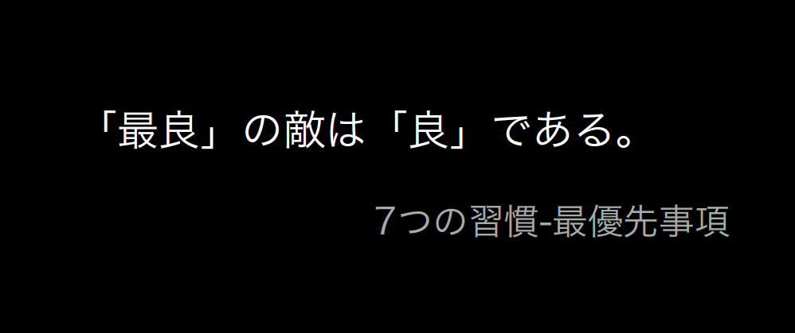
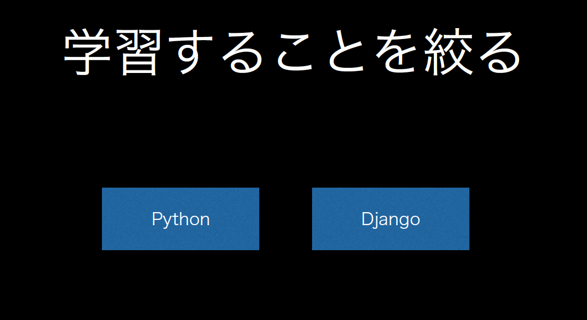
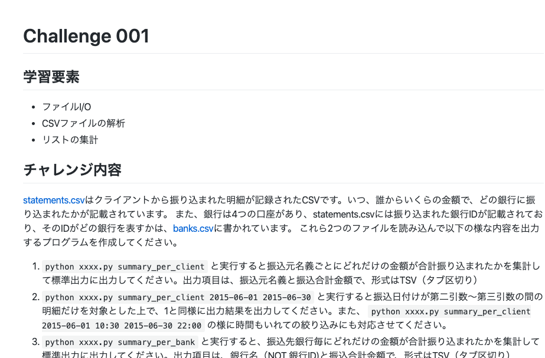

==========================================================
Rookieに良くする話
==========================================================

| tell-k
| BPStudy #150 (2020.02.18)

おまえ誰よ？
=====================================

.. image:: https://pbs.twimg.com/profile_images/1045138776224231425/3GD8eWeG_200x200.jpg

* tell-k
* BePROUD.inc
* 情弱プログラマー
* https://twitter.com/tell_k
* https://tell-k.github.io/bpstudy150/

目的/動機
=====================================

* 発表者はRookiesという社内の取り組みで、新しく入社したエンジニアの方のコードレビューをすることが比較的多く、さまざまなバックグラウンドを持つ方々と接してきました。
* それらのコードレビューで実践して得た知見や共通のハマりポイントみたいなのをまとめて発表しようと思った次第。
* また、そこで得た知見は『自走プログラマー』にもいくつか執筆しました。

自走プログラマー
=====================================

.. image:: https://images-na.ssl-images-amazon.com/images/I/410FSLNj5lL._SX396_BO1,204,203,200_.jpg
   :width: 40%

対象者
=====================================

* プログラマーになってみたい人
* 実際プログラマーとして働く時に、どんなコードレビューされるのか興味がある人。
* 自走プログラマーを読んでみる一歩手前がぐらいの人

Rookiesとは？
=====================================

* 経験が浅い人向けの、弊社の新人研修のようなものです。
* 弊社では、素養がある人であれば経験が乏しくても採用するケースがあります。
* 曰く、人材のパイを取り合うのではなく、パイを創りたいからだそうです(ドヤァ

経験が浅い人とは？
=====================================

* 学生
* Pythonでの仕事は初めての人
* 大学講師
* 営業
* 広報
* 銀行事務職
* ガールズバー店長
* オーストラリアで無職

Rookiesとは？
=====================================

* BPは受託がメインで、経験が浅い人は、Slackのrookies部屋に入れられて、開発に慣れるようにしてもらっています。
* 2015年から初めて合計23人くらい受けています。
* 実案件に入って、早く成長してもらうため、必要最低限のスキルや知識を獲得してもらう狙いです。

早く成長するためには？
====================================

.. image:: _static/img/good_elements.png
   :width: 80%

最良にフォーカス
====================================

　

学習することを絞る
====================================

　

1人前を目指す
====================================

* チケット/バージョン管理
* 開発の作業見積もりができる
* 安定した品質のコードをスピーディに書くことができる
* コードのレビューで、ほぼ指摘なしでパスできる
* 実業務のプロジェクトにアサインされて一人で簡単な機能の設計･開発・テストをそこそこのスピードで開発し、 レビューをほぼパスする

どんな感じのことやるの？
====================================

* GitHub上にある課題リポジトリをクローンして開発してもらう
* 簡単なCLIツールからDjangoを使ったWebアプリの開発まである
* 2週間 〜 1ヶ月くらいの期間で作業する
* チケットで依頼 -> 開発 -> コードレビュー -> 修正 -> マージ までを慣れてもらう
* 他の人のコードを見てもOK
* 特定のトピックに関してはPyQ(社員)を利用して自習してもらう
* BP著 の Python Professional Programming でチーム開発に必要になりそうな箇所を読書会

  * Chapter5 課題管理とレビュー
  * Chapter6 Git/GitHub によるソースコード管理

* 有志でリモートで読書会を開いて参加してもらったりする

Python Professional Programing
====================================

.. image:: https://images-fe.ssl-images-amazon.com/images/I/419ZPrd-cVL.jpg
   :width: 40%

課題のリポジトリ
====================================

こんな感じのリポジトリを cloneするところからスタート

.. image:: _static/img/python_challenge.png
   :width: 80%

課題はどんなの？
====================================

レビューで良く指摘されるポイント
====================================

ガード節/早期リターン
=====================================

* 関数の特殊なケース、失敗したケースは、関数の先頭ですぐにリターンしようという話。
* ネストが深いコードは理解しにくいので、ネストを浅く保ち可読性を良くするテクニック。
* `ガード節を用いた if-then-else 文の置き換え <http://blog.livedoor.jp/lalha/archives/50472164.html>`_
* リファクタリングやリーダブルコード などで紹介されてる

ガード節/早期リターン
=====================================

* どっからどこまで特殊なケースなのか正常なケースなのかわかりづらい

.. code-block:: python

 # Bad ---

 def something_func(reply, user_result, permission_result):

     if user_result == STATUS_SUCCESS:
         if permission_result == STATUS_SUCCESS:
             reply.write_errors("error reading permissions")
             reply.done()
             return
         reply.write_errors("")
     else:

         reply.write_errors(user_result)

     reply.done()

ガード節/早期リターン
=====================================

.. code-block:: python

  # Bad ---

  def something_func(reply, user_result, permission_result):
  
      if user_result != STATUS_SUCCESS:
          reply.write_errors(user_result)
          reply.done()
          return
  
      if permission_result != STATUS_SUCCESS:
          reply.write_errors("error reading permissions")
          reply.done()
          return

      # ここからが正常な処理
      reply.write_errors("")
      reply.done()

* 知識としては知っていても、いざ課題をやったりすると、早期リターンを活用できてないというケースがある

処理効率の悪い探索
=====================================

* リスト操作などをする時にループを無駄に回してしまうようなケース

.. code-block:: python

  for bank_id, amount in aggregates.items():

      # Bad ---
      bank_name = ""
      for bank in banks:
          if bank_id  == bank.id:
              bank_name = bank.name

      print(f"{bank_name} への振込金額は {amount}円です")

* 最悪「aggregatesの全件数 * banksの全件数」のループが回ってしまう。

処理効率の悪い探索
=====================================

* メモリに乗るのであれば予め辞書にして、キー指定ですぐにデータが見つかるようにする

.. code-block:: python

  # 予めた探索しやすいようなデータを作っておく
  bank_dict = {b.id: b for b in banks}

  for bank_id, amount in aggregates.items():

        # Good
        bank_name = bank_dict[bank_id].name
        print(f"{bank_name} への振込金額は {amount}円です")

* 逆に、不必要に辞書化してメモリを無駄に消費してしまうというケースもあります。

処理効率の悪い探索
=====================================

* もう必要ないのにループを継続してしまうケースもある。
* id に 紐づく bankは 一つだけ。
* なので見つかった後の for ループは無駄になってるケース。

.. code-block:: python

  for bank in banks:
      if bank_id == bank.id:
          bank_name = bank.name
          break  # <- ここで breakすればループはそこで止まる

境界値の扱い
=====================================

* 日時による絞り込みなどの境界値扱いなども、指摘されすいものの一つ
* 例えば 2020/01/01 0時 から 2020/01/02 いっぱいまでの絞り込みをしたい
* アバウトな要求に対して、期間の終わりを23時59分59秒としてしまうと漏れてしまうケースがある

.. code-block:: python

  # Bad  ---
  from datetime import datetime

  target = datetime(2020, 1, 2, 23, 59, 59, 1) # 2020/01/02 ではあるが絞り込みからは漏れてしまう 
  
  start = datetime(2020, 1, 1)
  end = datetime(2020, 1, 2, 23, 59, 59) 

  print(start <= target <= end) # => False

.. code-block:: python

  # Good  ---
  start = datetime(2020, 1, 1)
  end = datetime(2020, 1, 3)  # 確実に漏れが発生しない条件を指定する

  print(start <= target < end) # => True

lint と code formatter
=====================================

* だいたいどの言語でも、推奨されるコーディングスタイルがあります。
* スタイルや規約に合わせて、コードをチェックするツールをlint(linter) と呼びます。
* 一方スタイルや規約に合わせて、自動でコードを整形するツールを formatterと呼びます。 go の gofmtなどが有名。
* 独学で学んだり、一人で開発したことがない人は、知ってても使ってないケースもあります。
* Pythonでいえば推奨されるコーディングスタイルとして PEP8
* code formatter は 最近だと black や autopep8、 yapf などがあります。
* 必ずレビューを出す時は flake8 が通るようにしてもらっています。
* 参考 `Pythonでの開発を効率的に進めるためのツール設定 <https://speakerdeck.com/aodag/pycon-kyushu-2019-pythondefalsekai-fa-woxiao-lu-de-nijin-merutamefalseturushe-ding>`_

変数の命名規則
=====================================

* PEP8 では どういう変数名にすると良いか書かれています。
* 読まないと見落としがちで、変な変数名をつけたり、意味が読み取れなかったします。
* PEP8 日本語訳(https://pep8-ja.readthedocs.io/ja/latest/#id25)

.. code-block:: python

 _single_leading_underscore ... 先頭にアンダースコア。
                                クラスやモジュールの内部だけで使うことを意味する

 single_trailing_underscore_ ... 末尾にアンダースコア。
                                 Pythonのキーワードと被る時に利用する

 // PEP8 には書いてないが多値を返すような関数の場合
 // 使わない値は "アンダースコアのみ" の変数に格納したりします。

 for var, _ in get_hoge_list():
     # ... varしかつかない処理

標準のライブラリや良く見る処理の実装
=========================================

* Python は `collections <https://docs.python.org/ja/3/library/collections.html>` や `itertools <https://docs.python.org/ja/3/library/itertools.html>` などの便利なライブラリが最初から入ってます。
* それらを使えばちょっと複雑な処理もスッキリかけたります。
* 例えば辞書を初期化する時に良く紹介するのは `collections.defaultdict` です。

.. code-block:: python

  # Bad ---

  summary = {}
  for name, amount in products.items():
      category = get_category_by_name(name)

      # いきなり金額を加算代入できないので、最初はキーを初期化する
      if name not in summary:
         summary[category] = amount
      else:
         summary[category] += amount

標準のライブラリや良く見る処理の実装
=========================================

.. code-block:: python

  # Good ---

  from collections import defaultdict

  summary = defaultdict(int)
  for name, amount in products.items():
      category = get_category_by_name(name)

      # 存在しないキーの場合は int(=0)で初期化される
      summary[category] += amount

その他
=====================================

* エラーを握り潰さない
* ファイルパスを適切に組み立てる
* 特定の数値や文字列などは定数化する
* デザインパターンの話(Pythonでのシングルトン)
* 内包表記、高階関数(map, filter, reduce)
* flattenなどの頻出するイディオム類
* Python3の正規表現の `\d` のメタ文字は全角にもマッチする罠(re.ASCIIフラグが必要)

コードレビューする・してもらう時の指針
==========================================

* レビューのやりとりは慣れないと結構フラストレーションがたまります。
* なので以下のような簡単 

レビュー観点
============

レビューする/される時に意識してもらいこと

- レビューの往復を減らす工夫をしたい
- 完璧は目指させない方が良さそう -> 要件を満たすものをまずは作れるようになることが大事
- Q&Aはチャットでやる -> PRの中でQだけ書いて終わりにしない
- 対応のレベルを MUST/SHOULD/MAY がわかるようにする
- 良い悪いを端的伝える。なぜそうなるのか伝える
- 考えてくださいではなく、こうしてくださいを伝える
- その上で、参考になりそうな一次ソース、参考記事、書籍を提示する

対応のレベルのイメージ

MUST

- 要件を満たしていない
- クリティカルなバグがある

SHOULD

- BPでは最終的にこれができるようになってほしい
- 処理効率が悪すぎる

MAY

- どっちでもいいけどBPは（俺は）こっちが好き
- こっちの変数名の方がわかりやすい

関連資料
========

-  `コードレビューの基本 <https://gist.github.com/taichi/b36c135001c161aeb1b240327ed044d6>`_

